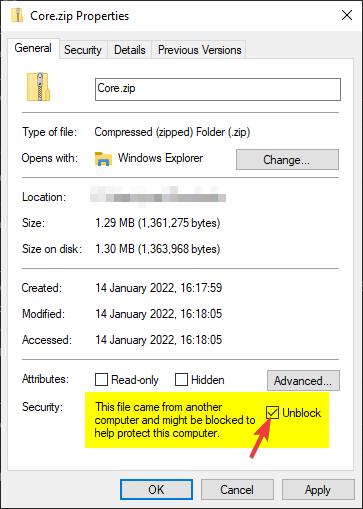
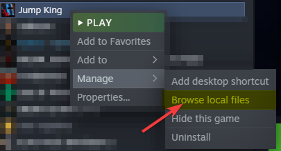
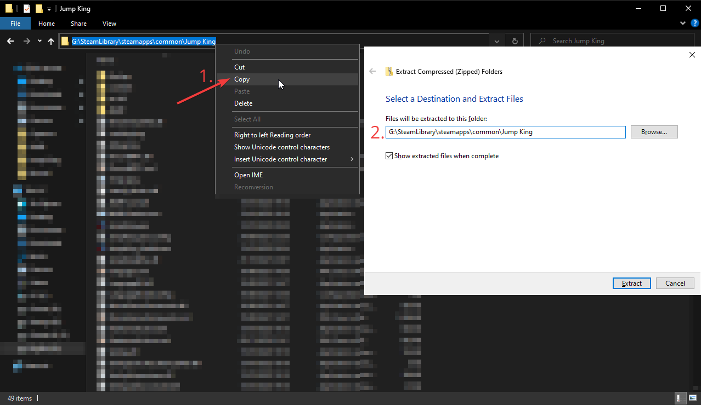
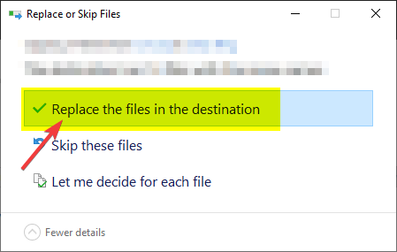
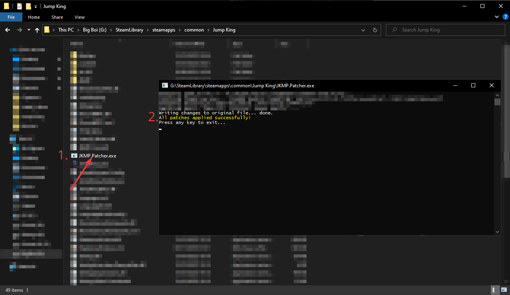
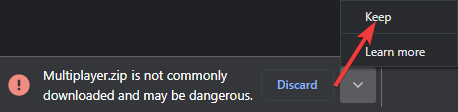

# Core
## About
Core is the modloader that manages plugins. It is required if you want to run Multiplayer or any other plugins.
## Download
[v0.8.3](https://github.com/Jump-King-Multiplayer/Releases/releases/download/core_0.8.3/Core.zip) (latest)

# Multiplayer
## About
This is the plugin that adds multiplayer support to Jump King.

**Note that it requires Core to be installed as well!**
## Download
### **Requires Core 0.8.3**
[v0.1.3](https://github.com/Jump-King-Multiplayer/Releases/releases/download/mp_0.1.3/Multiplayer.zip) (latest)\
[v0.1.2](https://github.com/Jump-King-Multiplayer/Releases/releases/download/mp_0.1.2/Multiplayer.zip)

# How to install Core
1. Download the latest version above.
   * (Optional) If your browser warns that the file is unsafe, choose the option to keep it anyway. This warning appears for files that are rarely downloaded. This will most likely be the case for new releases.
2. Open the location of the zip file and right click it and press Properties at the bottom.
3. Check ```Unblock``` in the bottom right of the window and then press OK. If it does not exist then you can skip this step.\
   
4. Right click the file and press ```Extract All...```
5. Right click the game in Steam and click ```Manage > Browse local files```.
   
6. Copy the file path and paste it into the extraction file path.
   
7. Click Extract and choose ```Replace the files in the destination``` when it asks to overwrite existing files.
   
8. Open the game folder and run JKMP.Patcher. Make sure the message ```All patches applied successfully!``` is displayed.
9.  

# How to install plugins
### In this guide we're gonna be using the Multiplayer plugin as an example.
1. Download the latest version of the plugin.
   * (Optional) If your browser warns that the file is unsafe, choose the option to keep it anyway. This warning appears for files that are rarely downloaded. This will most likely be the case for new releases.
   
2. Open the location of the zip file and right click it and press Properties at the bottom.
3. Check ```Unblock``` in the bottom right of the window and then press OK. If it does not exist then you can skip this step.
4. **(Optional) If you're installing a new version of the mod, delete the old one first in the game folder ```JKMP/Plugins/Multiplayer```.**
5. Right click the downloaded zip file and press ```Extract all```
6. Right click the game in Steam and click ```Manage > Browse local files```.
   
7. Copy the file path and paste it into the extraction file path.
   
8. If you get the question to overwrite existing files make sure you deleted the previous version of the plugin first.

# Troubleshooting
(todo)